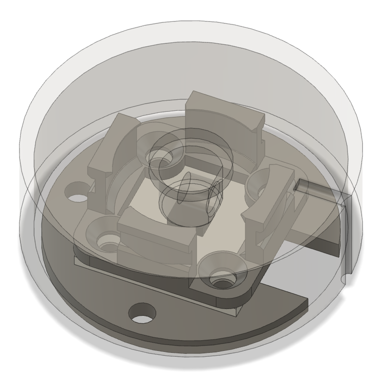
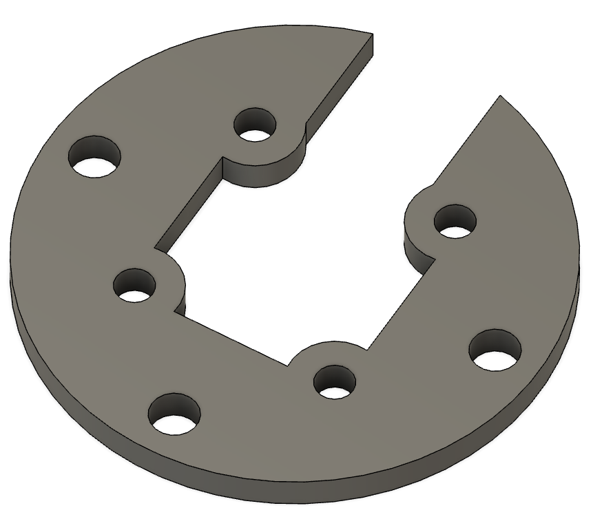
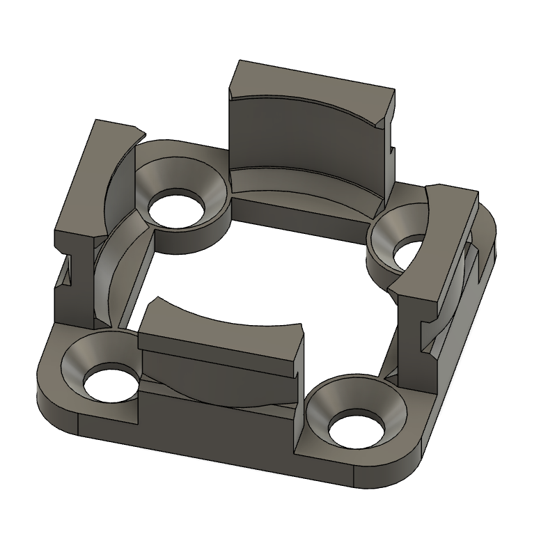
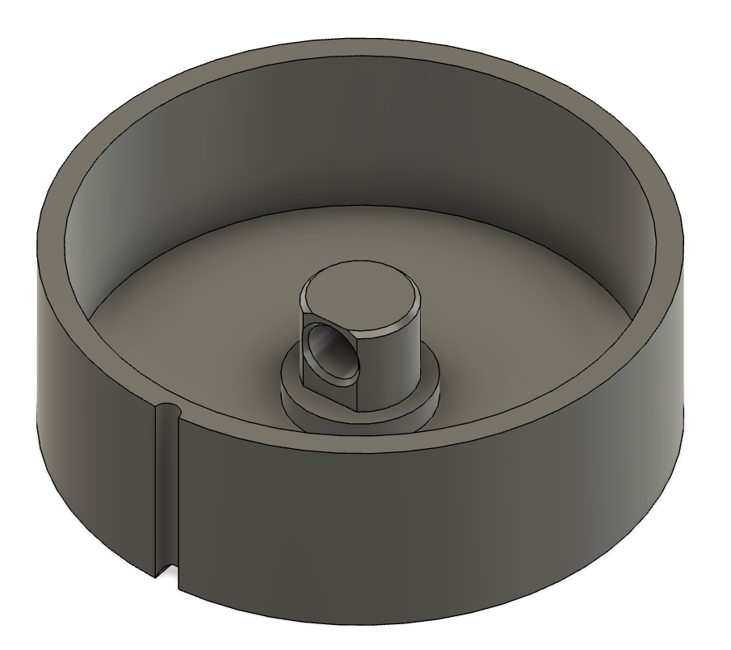
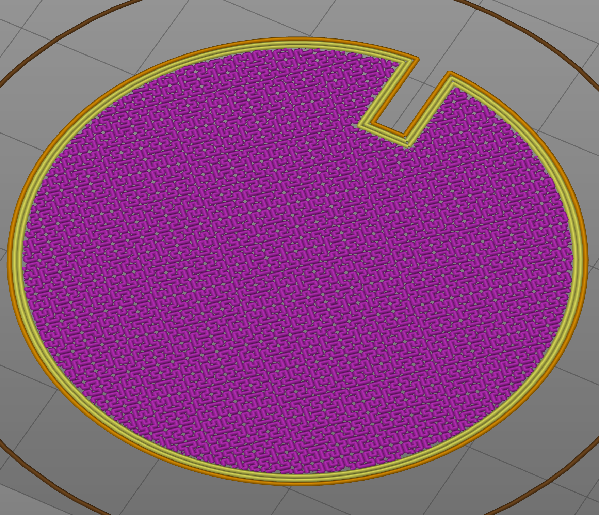

A cheap, 3D printed absolute position encoder knob based on a low-cost AS5600 breakout module.

<a href="https://github.com/scottbez1/AS5600Knob/tree/master/src">Demo firmware</a> using a TTGO T-Display ESP32 board is provided (PlatformIO Arduino).

See how it works:

# Parts needed
- AS5600 module (R1 removed to run at 5V)
- 4x M3x6 screws with countersunk head
- 608 "skateboard" bearing
- small zip tie (~2mm wide)
- 4mmx2mm axial magnet
- 3D printed parts (see below)

Note: R1 is removed on the AS5600 module in order to run it at 5V instead of 3.3V, which I found was more reliable and stable. No level-shifting is needed to connect to an ESP32 at 3.3V since it uses I2C.

I used a 4mm axial magnet instead of a diametric magnet because the AS5600 module I bought didn't come with a proper diametric magnet. You could modify the design to mount a diametric magnet aligned axially with the knob instead, if you have one.

# 3D Printed Parts

Download the Fusion 360 design file <a href="https://github.com/scottbez1/AS5600Knob/raw/master/as5600Knob%20v23.f3d" target="_blank">here</a> or <a href="https://a360.co/3juvdKy" target="_blank">preview it in your browser</a>.

## Base Plate

Print settings:
- 0.2mm layers

Download [STL file](https://github.com/scottbez1/AS5600Knob/blob/master/AS5600BasePlate.stl)

## Bearing Mount

Print settings:
- 0.15mm layers (finer layers for small details of tabs)

Download [STL file](https://github.com/scottbez1/AS5600Knob/blob/master/AS5600BearingMount.stl)

## Knob

Print settings:
- Seam: rear (seam is aligned with index notch to reduce visibility)
- I used hilbert curve bottom infill for a cooler top surface pattern (see 2nd photo above)
- 0.2mm layers

Download [STL file](https://github.com/scottbez1/AS5600Knob/blob/master/AS5600Knob.stl)

# Notes

- All of the dimensions were tuned to my 3D printer, so they may not work exactly, depending on how my printer's over/under-extrusion compares to yours
- The M3 screws thread directly into the base plate, which isn't super strong. You could make the base plate thicker, widen the holes, and use captive nuts or threaded inserts for a more robust connection
- You could decrease the diameter of the knob if you removed the external mounting holes from the base plate -- you could use longer M3 screws through the bearing mount, PCB, and base plate to mount it to something else directly instead
- The Fusion 360 file is somewhat messy and isn't parametric; this was just as a quick hack, sorry!

# License

Copyright 2021 Scott Bezek

   Licensed under the Apache License, Version 2.0 (the "License");
   you may not use this file except in compliance with the License.
   You may obtain a copy of the License at

       http://www.apache.org/licenses/LICENSE-2.0

   Unless required by applicable law or agreed to in writing, software
   distributed under the License is distributed on an "AS IS" BASIS,
   WITHOUT WARRANTIES OR CONDITIONS OF ANY KIND, either express or implied.
   See the License for the specific language governing permissions and
   limitations under the License.
